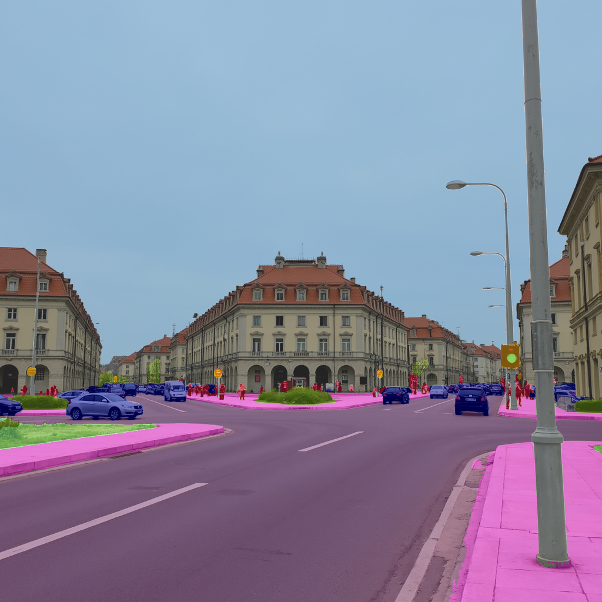
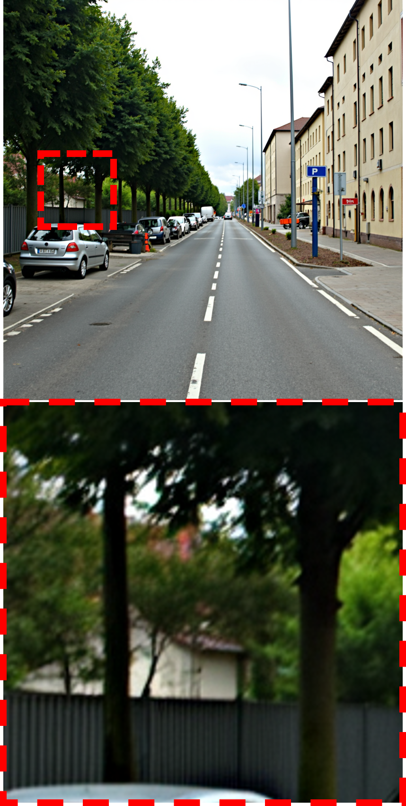

# What Makes Synthetic Data Effective in Image Segmentation (ICML 2026)

By Jinjin Zhang, Xiefan Guo, Yizhou Jin, Nan Zhou and Di Huang.


## Introduction
We propose SENSE, a unified framework that leverages flexible and scalable synthetic data to substantially enhance segmentation performance. 
Notably, SENSE is model-agnostic, compatible with diverse architectures (e.g., DPT and Mask2Former), and scales effectively across models with varying parameter capacities. 
Extensive experiments on Cityscapes, COCO, and ADE20K validate the effectiveness and generalization capability of our approach.

<!-- ## What Makes Synthetic Data Effective?

* Holistic Scene Composition


| Sparse Composition | Dense Composition |
| ------ | ------ |
|  |  |

* Local Instance Fidelity

| Coarse Fidelity | Fine Fidelity |
| ------ | ------ |
|  |  | -->


## Installation

Install the required packages:

```
pip install -r requirements.txt
```

Generate images with prompts in *prompts* folder and prepare data:

```
├── ./data
    ├── ADE20K
      ├── ADEChallengeData2016
        ├── images
          ├── training
          ├── validataion
          ├── generative_images
        ├── annotations
          ├── training
          ├── validataion
    ├── cityscapes
      ├── leftImg8bit
      ├── generative_images
    └── coco
      ├── train2017
      ├── val2017
      ├── masks
      ├── generative_images
```

Pre-trained Models
```
├── ./pretrained
    ├── dinov2_small.pth
    ├── dinov2_base.pth
    └── dinov3_large.pth
```

Prepare the generative image path for dataloader in the *splits/{dataset}/generative/unlabeled.txt*, for example:
```
generative_images/flux_seed1/cologne_000053_000019_leftImg8bit.png None
generative_images/flux_wlf_seed1/cologne_000053_000019_leftImg8bit.png None
```

## Train

For DPT training:
```
sh scripts/train_dpt.sh
```

For Mask2Former training:
```
sh scripts/train_mask2former.sh
```

## Acknowledgement

We are grateful for the following awesome projects and models when implementing SENSE:

* [Diffusers](https://github.com/huggingface/diffusers).
* [UniMatch V2](https://github.com/LiheYoung/UniMatch-V2).
* [Flux](https://github.com/black-forest-labs/flux).
* [GroundingDINO](https://github.com/idea-research/groundingdino).
* [Flux-WLF (Diffusion-4K)](https://github.com/zhang0jhon/diffusion-4k).

## Citation

If you find this project useful, please consider citing:

```
@inproceedings{zhang2026sense,
  title={What Makes Synthetic Data Effective in Image Segmentation},
  author={Zhang, Jinjin and Guo, Xiefan and Jin, Yizhou and Zhou, Nan and Huang, Di},
  booktitle={International Conference on Machine Learning},
  year={2026}
}
```